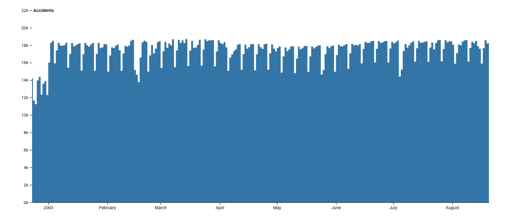
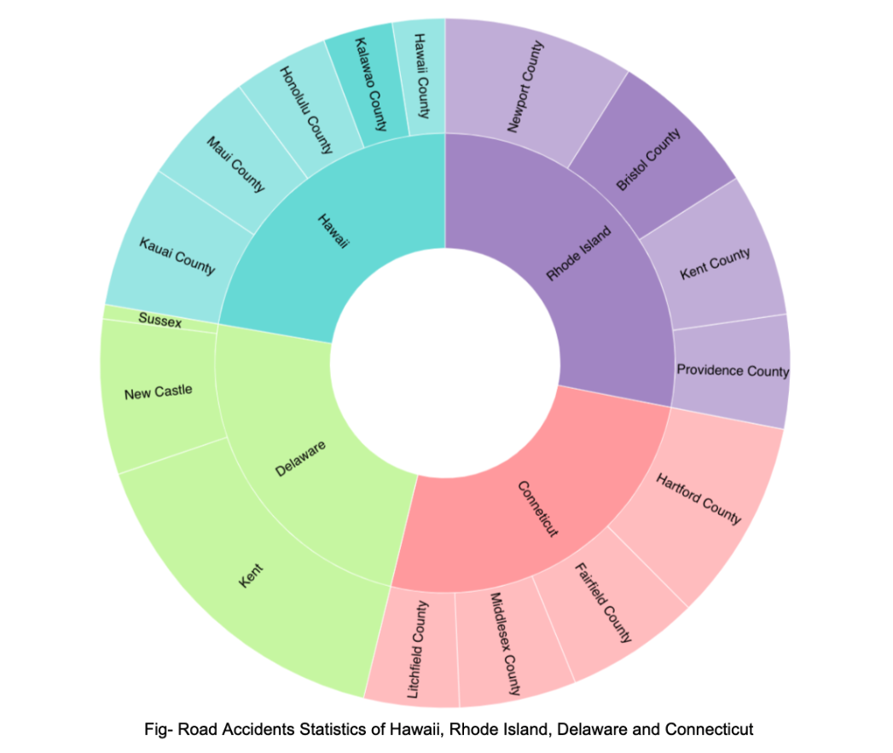
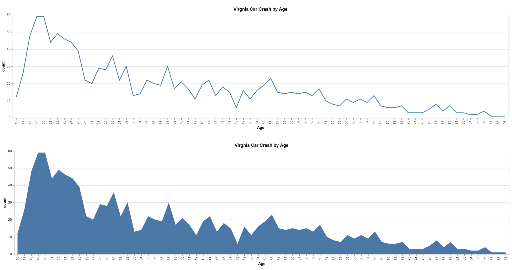
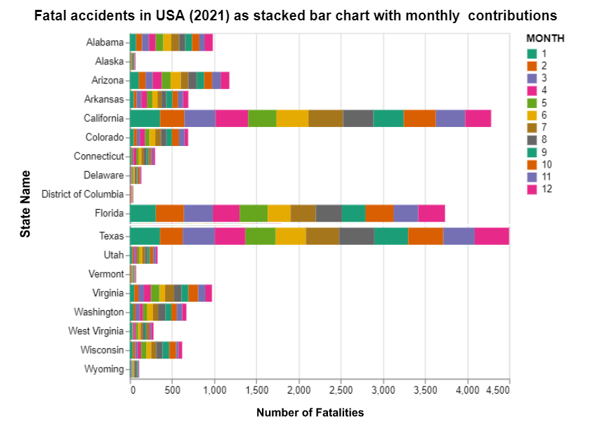

# Information Visulization (CS 5764) Final Project

## Zoomable Area Chart

We create the Zoomable Area-chart using the code inside the folder zoomable-area-chart. Please check README.md file inside the folder for more instructions. We need to change the csv inside zoomable-area-chart/files by the csv from data/accidents.csv to get the first image. 

## Zoomable Sunburst

We create the Zoomable Sunburst using the code inside the folder zoomable-sunburst. Please check README.md file inside the folder for more instructions. We need to change the json inside zoomable-sunburst/files by the json from data/small-states.json to get the second image.

## Area/Line Graph

We create the Area/Line graph using the code inside the area-and-line-graph folder line. Please check README.md file inside the folder for more instructions.

## Stacked Bar hart

Here we have created the Stacked bar chart using the code inside the folder Stacked_bar_chart. Please check README.md file inside the folder for more instructions. We need to change the json inside Stacked_bar_chart/files by the json from data/accident_FARS2021NationalCSV.scv to get the following image.The stacked bar graph breaks down the data by both location and time of year. Each state has a bar graph which is further broken down by the months of the year.
